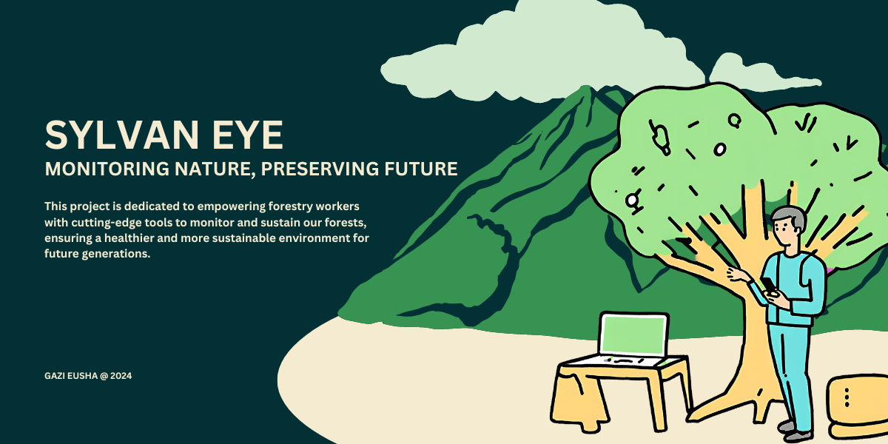

# IoT Environmental Sensor and Webserver



This project is a prototype for an IoT-based environmental sensor designed to assist forestry workers in monitoring tree growth conditions. The sensor, emulated using the **Sense HAT**, collects environmental data such as temperature, humidity, and wind conditions, and communicates with a webserver to log and display this data in real-time.

## Table of Contents

- [Project Overview](#project-overview)
- [Features](#features)
  - [IoT Device](#iot-device)
  - [Webserver](#webserver)
- [Setup and Installation](#setup-and-installation)
- [Usage](#usage)
  - [IoT Device Usage](#iot-device-usage)
  - [Webserver Usage](#webserver-usage)
- [System Diagram](#system-diagram)
- [Contributing](#contributing)
- [License](#license)

## Project Overview

This project combines an IoT device that uses the **Sense HAT** emulator to monitor environmental conditions and a webserver that logs and displays this data. The device detects movement events in real-time, classifies them (e.g., as normal, windy, or a collision), and sends the data to a PHP-based webserver. The server logs these events and provides a user-friendly interface to view the logged data.

## Features

### IoT Device

- **Movement Detection & Classification:** Detects and classifies movement events into categories like normal, windy, or collision based on preset thresholds.
- **Environmental Data Reporting:** Reports environmental data such as temperature, humidity, and wind conditions to the server every minute.
- **Error Handling:** Displays error messages if the server fails to acknowledge the report.
- **Setup Mode:** Allows for manual adjustment of temperature and humidity thresholds via the Sense HAT buttons.

### Webserver

- **Data Logging:** Receives data from the IoT device and logs it in an XML file.
- **Web Interface:** Provides a user-friendly web interface to view logged data, including:
  - Total number of timestamps recorded.
  - Current temperature and humidity thresholds.
  - Details of any events exceeding thresholds or involving collisions.

## Setup and Installation

Follow the steps below to set up the IoT device and the webserver.

### 1. Clone the Repository

```bash
git clone https://github.com/Eusha425/sylvan-eye.git
cd sylvan-eye
```

### 2. Install Dependencies

- **For the IoT Device (Python):**

```bash
pip install sense_hat
```

- **For the Webserver (PHP):**
  - Ensure you have a web server (e.g., Apache) and PHP installed on your system.

### 3. Start the Webserver

- Place the `webserver.php` and `displaywebserver.php` files in your web server's root directory (e.g., `/var/www/html` for Apache).

### 4. Run the IoT Device Script

```bash
python iot_device.py
```

## Usage

### IoT Device Usage

- **Normal Operation Mode:**
  - The device will report environmental data (temperature, humidity, and wind conditions) to the server every minute.
  
- **Setup Mode:**
  - To enter Setup Mode, press the middle button on the Sense HAT (while not in a collision state).
  - Use the left and right buttons to switch between temperature and humidity settings.
  - Use the up and down buttons to adjust the thresholds.
  - Press the middle button again to exit Setup Mode.

### Webserver Usage

- Access the **`displaywebserver.php`** file via your web browser to view the logged data.
  - This page will display the total number of data logs, the current temperature and humidity thresholds, and any events that exceed thresholds or involve collisions.

## System Diagram

Below is a system diagram showing how the IoT device communicates with the webserver:


## Contributing

Contributions are welcome! If you'd like to contribute to the project, please follow these steps:

1. Fork the repository.
2. Create a new branch.
3. Make your changes or additions.
4. Submit a pull request with a description of your changes.

For any bugs or feature requests, please open an issue.

## License

This project is licensed under the **MIT License**. See the [LICENSE](./LICENSE) file for details.
